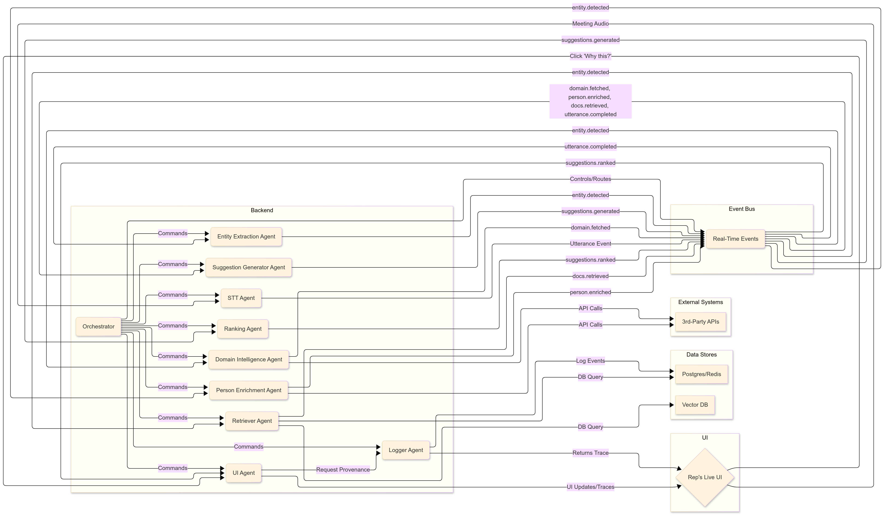

# Overlayy - Agentic Live Sales Assistant
- This is combined submission of our Team Explorers and Exploiters: **Soham Mukherjee** (Gaixen) and **Akshat Kasarwal** (Akshat7776)<br>

#### Small labeled dataset for accuracy/relevance testing [Evaluation Suite](https://docs.google.com/spreadsheets/d/14IvQgS6KId1UkU5Tmcy28XF72CPzhK2Q/edit?usp=drive_link&ouid=104840222808752851253&rtpof=true&sd=true)

### Running Instructions

1. **Clone the repository**
   ```sh
   git clone https://github.com/gaixen/OOSC-25_EnE.git oosc-25_EnE
   cd OOSC-25_EnE
   ```

2. **Install Python dependencies**
   ```sh
   pip install -r requirements.txt
   python -m spacy download en_core_web_sm
   ```

3. **Set up environment variables**
   - Create a `.env` file in `src/` and add required API keys:
     ```
     GEMINI_API_KEY=your-gemini-key
     ASSEMBLYAI_API_KEY=your-assemblyai-key
     HUNTER_API_KEY=your-hunter-key
     REDIS_HOST=localhost
     REDIS_PORT=6379
     ```

4. **Setup Redis**
   - Ensure Redis and Postgres are running locally or update connection settings in the code.
   - **For Windows**
     1. Install [Docker for Windows](https://www.docker.com/products/docker-desktop/)
     2. Run the Redis container:
        ```sh
        docker run --name redis -p 6379:6379 -d redis
        ```
     3. Verify Redis is running:
          ```sh
          docker exec -it redis redis-cli ping
          ```
          You should see `PONG`.
     
   - **For MacOS**
     1. Install [Docker for Mac](https://www.docker.com/products/docker-desktop/)
     2. Run Redis Container:
        ```sh
        docker run --name redis -p 6379:6379 -d redis
        ```
   - **For Linux(Ubuntu)**
     1. Update and install:
        ```sh
        sudo apt update
        sudo apt install redis-server -y
        ```
     2. Start Redis:
          ```sh
          sudo systemctl enable redis-server
          sudo systemctl start redis-server
          ``` 
     3. Verify Redis:
          ```sh
          redis-cli ping
          ``` 
5. **Run the frontend**
   ```sh
   cd frontend
   npm install
   npm run dev
   ```
6. **Run the backend**
   ```sh
   python main.py
   ```

7. **Connect UI**
   - The UI connects via WebSocket (`UI_WS_URL`) to receive agent events and display provenance.

---

### Architecture

---

### Folder Structure
This is the proper folder structure of the project for the Overlayy  project containing both frontend and backend.


---
### Agent Interaction Overview

1. **Orchestrator:**<Br>
Central coordinator that manages the workflow.
Invokes other agents in sequence: transcription, entity extraction, enrichment, suggestion, ranking, and UI.
Maintains session state and handles fallbacks if any agent fails.
Example: Orchestrator.process_meeting() coordinates the entire pipeline.
2. **STT Agent:**<Br>
Speech-to-Text agent using AssemblyAI (can be extended to Whisper/Google).
Converts meeting audio to text and emits utterance events.
Handles real-time transcription and speaker identification.
3. **Entity Extraction Agent:**<Br>
Extracts entities (companies, people, competitors, products) from transcript text.
Uses spaCy and Gemini for coreference resolution and entity refinement.
Emits structured entity data for downstream agents.
4. **Domain Intelligence Agent:**<Br>
Fetches company/domain intelligence:
companyProfileAgent.py: Gets company profile from Hunter.io and Wikipedia.
companyNews.py: Aggregates news from Yahoo, Bloomberg, Google News.
marketCompetitor.py: (Assumed) Fetches competitor info.
Deduplicates, ranks, and tags data with sources and confidence.
5. **Person Enrichment Agent:**<Br>
Resolves public profiles for people mentioned in the meeting.
Uses Hunter.io, Wikipedia, DuckDuckGo, LinkedIn.
Provides bullet points and provenance for each person.
6. **Retriever Agent:**<Br>
Fetches supporting documents or web summaries for context.
Uses a static knowledge base (prototype) or can be extended to vector DB/web search.
Returns evidence and provenance for suggestions.
7. **Suggestion Generator Agent:**<Br>
Generates contextual talking points using LLMs (Gemini, OpenAI, etc.).
Uses domain/person context and transcript to create suggestions.
Tags each suggestion with provenance and sources.
8. **Ranking Agent:**<Br>
Ranks suggestions by relevance and confidence.
Assigns confidence scores and provenance chains.
Orders suggestions for display in the UI.
9. **UI Agent:**<Br>
Streams agent status, suggestions, and traces to the frontend via WebSocket.
Updates UI with current agent indicator, provenance, and evidence cards.
Supports trace expansion and replay for transparency.

#### Interaction Flow

1. **Meeting starts**: Orchestrator issues `session_id`, UI subscribes.
2. **STT Agent**: Streams utterances.
3. **Entity Extraction**: Detects entities (e.g., company names).
4. **Domain/Person/Retriever Agents**: Fetch relevant info.
5. **Suggestion Generator**: Creates talking points.
6. **Ranking Agent**: Orders suggestions, adds provenance.
7. **UI Agent**: Streams bullets, agent indicator, and trace to frontend.
8. **User actions**: UI allows trace expansion, replay, and feedback.

---

### Compliance Checklist

- **Privacy**
  - All PII is handled according to retention and consent policies.
  - Agents enforce delete-on-request and retention settings.
  - Only public domain/person info is fetched; no private data is stored.

- **Transparency**
  - All suggestions and actions are tagged with agent name, confidence, and sources.
  - UI provides agent indicator, trace expansion, and replay mode.

- **Auditability**
  - Logger/Audit agent stores immutable logs and provenance chains.
  - All agent actions are traceable and reviewable.

- **Fallbacks**
  - Orchestrator enforces timeouts and retries.
  - Graceful degradation to LLM fallback if third-party APIs fail.
  - Low-confidence suggestions are indicated in the UI.

- **Security**
  - Secrets are managed via environment variables or secret manager.
  - API keys are not hardcoded; use `.env` or secret vault.

---